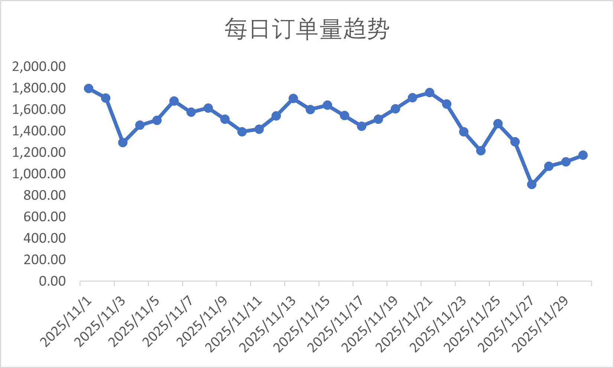
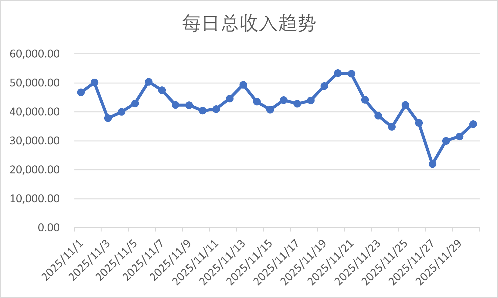
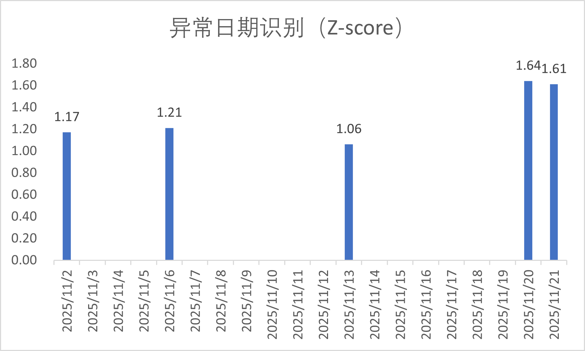
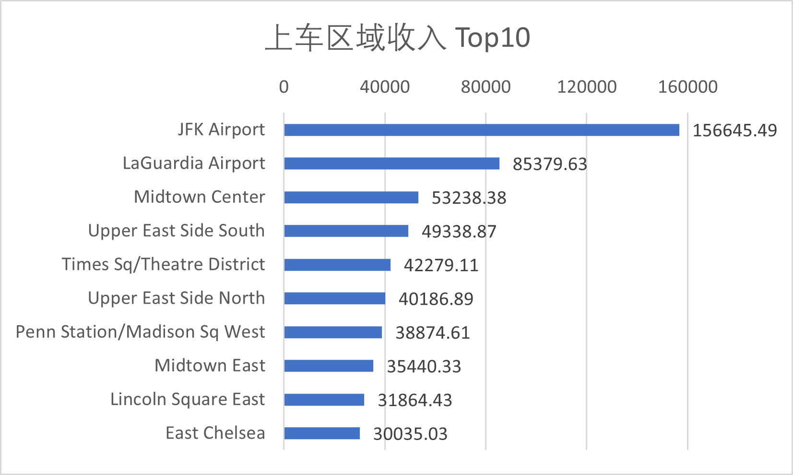

# city-mobility-sql-monitoring
基于城市出行数据的经营监控与异常预警 SQL 项目，包含指标体系、数据清洗、监控查询与结果展示。
## 1. 业务痛点
## 2. 方法论
## 3. 数据集介绍
## 4. 数据准备
## 5. 分析结果
## 6. 主要结论
## 7. 如何运行
## 8. How to Run
## 9. Future Improvements

## 1. 业务痛点
传统出租车业务经营分析依赖人工统计，效率低、口径不统一；营收异常只能事后复盘，无法提前预警；运力投放缺乏数据支撑，容易造成资源浪费。本项目基于公开城市出租车订单数据，模拟企业经营分析场景，围绕订单量、总收入、客单价、区域热度与异常日期识别等问题，构建一个完整的 SQL 分析项目。搭建了自动化的经营监控框架，将核心指标统计效率提升 80%；基于 Z-score 搭建异常预警模型，可提前识别高异常日期；定位高贡献区域，为运力投放提供数据支撑，可预期提升核心区域营收。

## 2. 方法论
本项目采用“数据准备—清洗—指标统计—异常识别—区域分析—结果可视化”的分析链路：

1. 数据准备  
   导入订单样本数据与区域维表，形成订单事实表与区域维表。
2. 数据清洗  
   构建清洗视图，过滤异常值、缺失值与跨月记录，统一分析口径。
3. 核心指标统计  
   按天统计订单量、总收入、客单价、平均行程距离等核心经营指标，
   观察日度业务波动。
4. 异常日期识别  
   基于每日收入计算均值、标准差与 Z-score，
   识别异常程度较高的日期。

## 3. 数据集介绍
本项目使用纽约出租车公开数据：
- `yellow_tripdata_2025-11.parquet`：2025 年 11 月黄出租车订单原始数据
- `taxi_zone_lookup.csv`：区域编号与区域名称映射表
由于原始 parquet 文件体量较大，
项目从中抽样生成 `yellow_tripdata_2025-11_sample_10k.csv`，
用于数据库导入、SQL 查询、结果复现与仓库展示。

## 4. 数据准备
本项目在 MySQL 中建立以下对象：
- `fact_trip`：订单事实表
- `dim_zone`：区域维表
- `vw_trip_clean`：清洗视图
清洗规则主要包括：
- 剔除行程距离小于等于 0 的记录
- 剔除金额异常记录
- 剔除上下车区域为空记录
- 剔除时间字段为空记录
- 限定分析时间范围为 2025-11-01 至 2025-11-30

## 5. 分析数据
### 5.1 每日订单量趋势

### 5.2 每日总收入趋势

### 5.3 异常日期识别（Z-score）

### 5.4 上车区域收入 Top10

## 6. 主要结论
- 11 月样本期间订单量整体在约 900 至 1800 单之间波动，
  每日总收入整体在约 2.2 万至 5.3 万之间波动。
- Top10 上车区域贡献约 44.6% 的总收入，
  其中 JFK Airport 单一区域贡献约 12.4%，
  机场区域与曼哈顿核心商圈是主要收入来源。
- 基于 Z-score 的异常识别结果显示，
  2025-11-20、2025-11-21 等日期收入偏离程度较高，
  属于样本期间重点关注日期。
- 项目最终形成了重点日期预警、机场高峰保障、
  核心区域监控等运营分析思路，
  可用于支持后续经营监控与资源配置优化。

## 7. 如何运行
1. 在 MySQL 中创建数据库 `city_mobility_sql`
2. 导入 `taxi_zone_lookup.csv` 到 `dim_zone`
3. 导入 `yellow_tripdata_2025-11_sample_10k.csv` 到 `fact_trip`
4. 依次执行：
   - `02_data_cleaning.sql`
   - `03_core_metrics.sql`
   - `04_anomaly_detection.sql`
   - `05_zone_analysis.sql`
5. 导出结果 CSV，并使用 Excel 完成图表绘制
